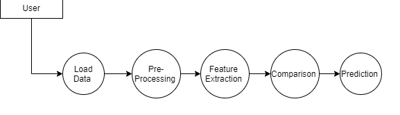
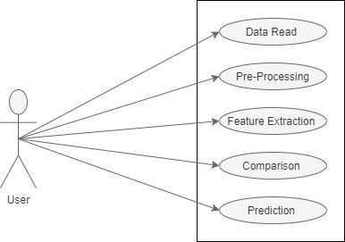
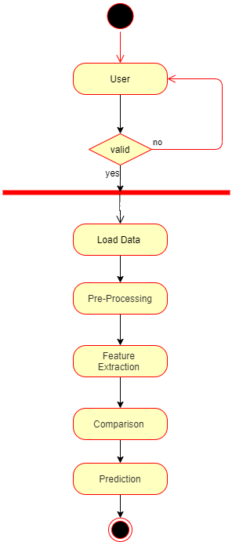
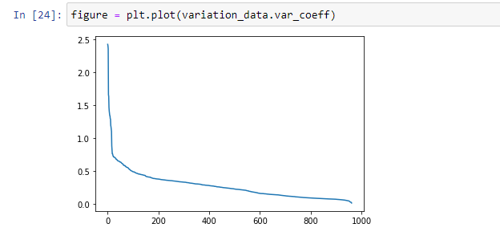
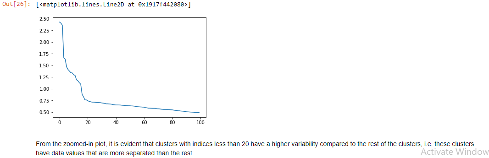

# OVERVIEW

Commodity price prediction serves as an important quantitative basis for commodity production planning-in particular for capacity planning. High level decision and planning in commodity production relies heavily on past commodity price. Many researches have shown that commodity price is subject to great volatile now then has been the case in the past. Many past predictive models for commodity price models have mixed performance .

The aim here is to develop a model that can accurately predict the price of commodity monthly for a particular district using the dataset available.

# INTRODUCTION
This document outlines the software requirements for analysing and forecasting a time series commodities price data. It will cover the overall description of the system, specific requirements as well as modelling requirements, diagrams and a description of a prototype to be built to demonstrate the system’s functionality

# Dataset Description (Name, Size etc.) 
Columns: The Data set contains 9 columns; The Initial 4 Columns are Commodity Name, State, District and Market for that Commodity 
Remaining 7 Columns are Arrival Date, Min_Price, Max_price, Modal_price, Arrival Quantity,Rainfall,Temp. 
Size: The total Size of Data is around 50MB and it Contain prices of Commodity for last 5 Years with Different market. 

# Data Dictionary 
1. Comm_name: Name of the Commodity, there are 5 Commodity in The Data
2. State: Describe the State for which prediction going to be done 
3. District_name: Each state have several no of districts 
4. Market_centre_name: Name of the market 
5. Arrival_date: Date of arrival of commodity in that Market 
6. MinPrice: Minimum price for which given commodity has been sold in the market 
7. MaxPrice: Maximum price for which given commodity has been sold in the market
8. ModalPrice: Price between minimum and maximum price. 
9. ArrivalQuantity: Amount of Quantity of commodity arrived in the market.

# Load Dataset 
In this segment user can load the data set to the application 
Raw Data:· In this stage, the historical stock data is agitated from https://www.quandl.com/data/NSE and this historical data is utilized for the prediction of future stock prices.

# Stage 2: Data Preprocessing:· The pre-processing step includes
a) Data discretization: Part of data reduction but with particular importance, especially for numerical data.
b) Data transformation: Normalization.
c) Data cleaning: Fill in missing null values.
d) Data integration: Integration of data files.
After the dataset is transformed right into a natural dataset, the dataset is split into schooling and finding out gadgets so that you can study. Here, the schooling values are taken because of the truth the extra cutting-edge values. Testing facts is saved as five-10 percent of the overall dataset.

# Feature Extraction:
In this sediment, most effective the competencies which may be to be fed to the neural network are selected. We will choose the function from Date, open, immoderate, low, near, and quantity.

# Output Generation:
In this sediment, the output fee generated with the aid of way of  manner comparison with the goal charge. The mistakes or the difference some of the motive and the acquired output which adjusts the weights and the biases of the community.

# Data Flow Diagram

# user case diagram

# user activity diagram

# ALGORITHM USED
# SVM ALGORITHM

Support Vector Machine” (SVM) is a supervised device studying set of guidelines which may be used for each beauty or regression stressful situations. However, it's far specially carried out in kind troubles. In the SVM set of policies, we plot every facts item as a problem in n-dimensional region (in which n is shape of abilities you've got) with the rate of each characteristic being the charge of a particular coordinate. Then, we carry out splendor with the resource of finding the hyper-aircraft that differentiates the two schooling very well.

Here, maximizing the distances among nearest records component (each class) and cluster information will assist us to determine the right type. This distance is called as Margin

# K-means
The way kmeans algorithm works is as follows:
1.	Specify number of clusters K.
2.	Initialize centroids by first shuffling the dataset and then randomly selecting K data points for the centroids without replacement.
3.	Keep iterating until there is no change to the centroids. i.e assignment of data points to clusters isn’t changing.
•	Compute the sum of the squared distance between data points and all centroids.
•	Assign each data point to the closest cluster (centroid).
•	Compute the centroids for the clusters by taking the average of the all data points that belong to each cluster.

# OUTPUTS
fluctuation of commoditiesprice over time.

